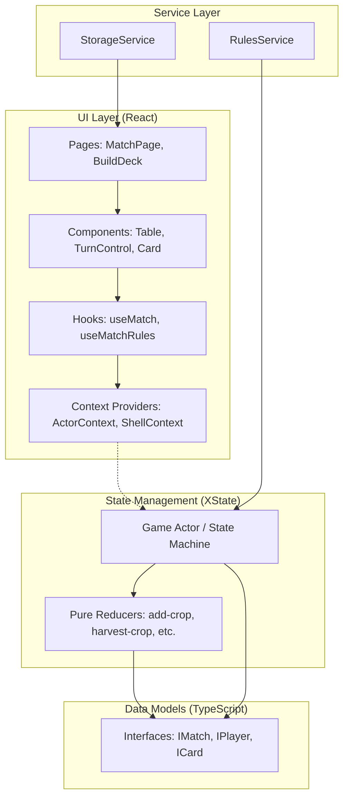
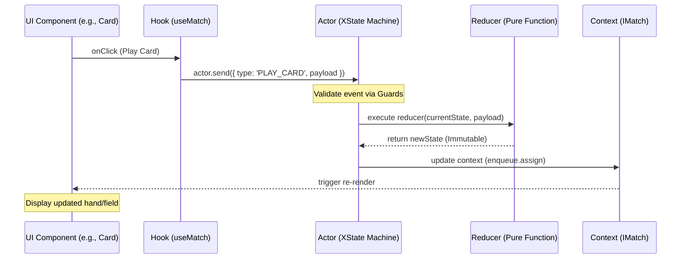
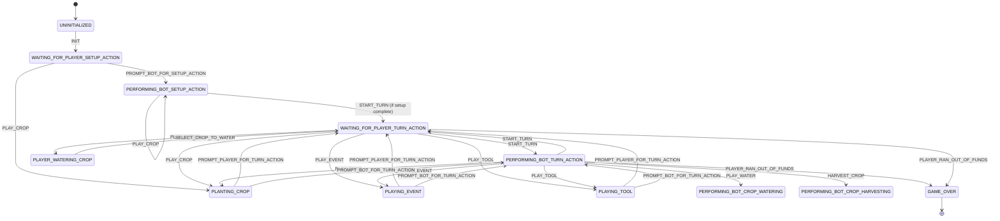

# Project Architecture: Farmhand Shuffle

The architecture of **Farmhand Shuffle** is a well-structured, modern TypeScript application that follows a clear separation of concerns between game logic, state management, and user interface. It leverages a robust state machine approach to manage the complexities of a turn-based card game.

---

## High-Level Overview

The system is organized into four primary layers:

1.  **Game Logic (The "Brain")**: Encapsulated within the `src/game` directory, this layer defines the rules, data models, and state transitions of the game. It is entirely decoupled from the UI and relies on a state machine (XState) to drive the game flow.
2.  **State Management**: Powered by **XState**, the application uses an actor-based model. The game state is managed by a `RulesService` that creates and runs a state machine (the "Actor"). This Actor holds the `MatchMachineContext`, which includes the current game state (`IMatch`), and provides a stream of updates.
3.  **Service Layer**: Business logic that isn't part of the core state machine (like storage or external rules) is encapsulated in services. The `RulesService` acts as the gateway to the game's engine.
4.  **UI Layer (The "Face")**: A React-based frontend that observes the game actor. It uses a combination of Context Providers (`ActorContext`, `ShellContext`) to distribute the game state and utility functions (like notifications) down the component tree.

---

## Component Architecture

The UI follows a modular, component-based pattern:

- **Pages**: High-level views like `MatchPage` and `BuildDeck` that orchestrate specific game scenarios.
- **Organisms (Complex Components)**: `Match` acts as the main orchestrator for a game session. It provides the necessary context via `ActorContext.Provider` and `ShellContext.Provider`.
- **Molecules & Atoms**: Smaller, reusable components like `Table`, `TurnControl`, `Snackbar`, and `Card` components.
- **Hooks**: Custom hooks like `useMatch` and `useMatchRules` encapsulate the logic for interacting with the game actor, providing a clean interface for components to access `match` data and `matchState`.

---

## State Management

The application uses an **Actor-based State Machine** pattern powered by **XState**, which acts as the central orchestrator for all game rules and flow.

### Core Concepts

- **The Actor (State Machine)**: A centralized XState machine that manages the lifecycle of a match. It maintains the current `MatchState` and processes `MatchEvent`s to drive transitions.
- **States**: Represent the discrete phases of a match (e.g., `WAITING_FOR_PLAYER_TURN_ACTION`, `PERFORMING_BOT_TURN_ACTION`, `PLANTING_CROP`). States encapsulate the valid events and logic applicable to that phase.
- **Events (Actions)**: Triggers that drive transitions. Events carry payloads required for logic (e.g., `PLAY_CARD` with `cardIdx`).
- **Context (`MatchMachineContext`)**: The single source of truth. It holds:
  - `match`: The `IMatch` object describing the game world (players, cards, field, funds).
  - `botState`: Internal state used to guide the bot's automated turn logic.
  - `shell`: An interface for triggering UI-side side effects (notifications).
- **Reducers**: Pure functions in `src/game/reducers` that perform immutable updates to the `match` context. These are invoked by the state machine during state entry/exit or transition actions.

### State Machine Workflow

The machine handles complex logic by delegating specific behaviors to specialized state implementations.

1.  **Event Reception**: An event (e.g., from the UI) is sent to the Actor.
2.  **Guards**: The machine checks if the event is valid for the current state using `MatchStateGuard`s (e.g., `IS_SELECTED_IDX_VALID`).
3.  **Transitions & Actions**:
    - **Entry/Exit Actions**: Logic executed when entering or leaving a state (e.g., triggering a notification or resetting a selection).
    - **Transition Actions**: Logic executed during the transition itself (e.g., calling a reducer to update the match state).
4.  **Context Evolution**: The machine uses `enqueue.assign` to update the context with the new, immutable `match` object returned by reducers.
5.  **Asynchronous Logic (Bot Turns)**: The machine manages bot turns by using `enqueue.raise` with a `delay` to simulate thinking time (`BOT_ACTION_DELAY`), transitioning through a sequence of sub-states (e.g., `INITIALIZING` $\rightarrow$ `PLAYING_CROPS` $\rightarrow$ `PLAYING_WATER` $\rightarrow$ ... $\rightarrow$ `DONE`).

### Error Handling

The machine utilizes a specialized error handling pattern via `withBotErrorHandling`. This wrapper catches specific errors (like `PlayerOutOfFundsError`) and transforms them into official `MatchEvent`s (like `PLAYER_RAN_OUT_OF_FUNDS`), ensuring that errors lead to controlled state transitions (e.g., to `GAME_OVER`) rather than application crashes.

---

## Service Layer

Services are implemented as singleton classes to provide utility and business logic:

- **`RulesService`**: The core service that initializes the game engine and manages the lifecycle of the match state machine.
- **`StorageService`**: Handles persistence, allowing players to save and load their decks.
- **`PricingService`**: Manages the logic for market fluctuations and crop values.

---

## Data Models / Entities

The core of the game is defined by several key TypeScript interfaces:

- **`IMatch`**: The top-level state object containing the `ITable` (players and community fund), the `currentPlayerId`, and market volatility (`buffedCrop`, `nerfedCrop`).
- **`IPlayer`**: Represents a participant, containing their `funds`, `deck`, `hand`, `discardPile`, and `field`.
- **`ICard`**: The base interface for all cards, with specialized implementations for `ICrop`, `IEvent`, `ITool`, and `IWater`.
- **`IPlayedCrop`**: A stateful representation of a crop currently in a player's field, tracking its `waterCards` count.

---

## Architecture Diagrams

### 1. High-Level Architecture (Block Diagram)

### 2. Data Flow Diagram (Event Lifecycle)

This diagram illustrates the lifecycle of an event, from a user interaction in the UI to the state update and subsequent UI re-render.

### 3. State Transition Diagram (Match Lifecycle)

This diagram shows the primary states of a match and the events that drive transitions between them.

