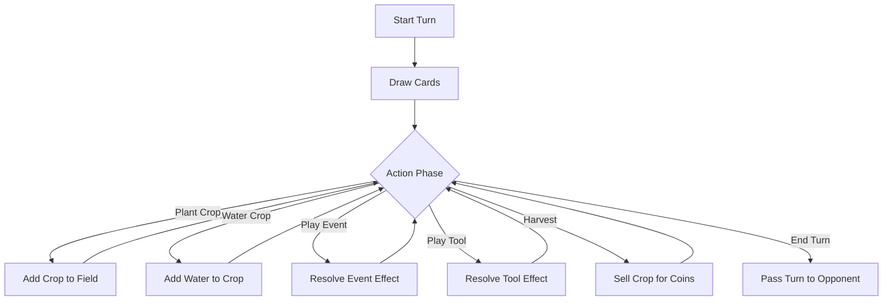

# Farmhand Shuffle: Game Rules & Design

Welcome to **Farmhand Shuffle**, a strategic card game where players compete to build the most profitable farm while sabotaging their rivals! This document outlines the high-level game rules, card types, and flow of play.

## 🎯 Objective

The goal of Farmhand Shuffle is simple: **Bankrupt the opponent.**

Players take turns managing their farms, harvesting crops for money, and paying taxes/fees. If a player runs out of funds (Coins), the game ends immediately, and the surviving player is declared the winner.

---

## 🃏 Card Types

There are four distinct types of cards in the deck:

### 🌱 Crops
These are the foundation of the farm.
- **Action:** Players plant these into their **Field** (maximum 6 slots).
- **Growth:** Each crop requires a specific amount of **Water** to mature.
- **Harvest:** Once fully watered, a crop can be harvested to earn Coins.

### 💧 Water
Essential for growing crops.
- **Action:** Players play a Water card directly onto a planted Crop in the field.
- **Effect:** Increases the crop's water level. When the water level meets the crop's requirement, it becomes ready for harvest. **Note:** The Water card is discarded after being applied to the crop.

### ⚡ Events
Powerful, one-time effects that can turn the tide of the game.
- **Limit:** Players can only play **1 Event card per turn**.
- **Effect:** Varied effects, such as stealing funds, destroying opponent crops, or drawing extra cards.
- **Strategy:** Many Event cards are designed with a trade-off, applying both a beneficial effect (buff) and a detrimental effect (nerf) to the player. This requires careful strategic planning.

### 🛠️ Tools
Utility cards that provide bonuses or special actions.
- **Limit:** Players can play as many Tool cards as they want during their turn.
- **Effect:** Can be immediate bonuses or lasting effects that help manage the farm more efficiently.
- **Strategy:** Like Events, Tools often involve a cost or penalty alongside their benefit, forcing players to weigh the long-term value of playing them.

---

## 🔄 Game Flow

The game is controlled by a state machine that ensures fair play and structured turns.

### 1. Setup Phase
Before the first turn begins:
- Each player starts with **50 Coins**.
- Each player draws an initial hand of **7 cards**.
- Players have a chance to plant initial crops into their field.
- Once setup is complete, the first turn begins.

### 2. Turn Structure

On a turn, the player is free to perform actions in any order until deciding to end the turn.

#### Key Actions
*   **Draw:** The player automatically draws 1 card at the start of the turn.
*   **Plant:** Move a Crop card from hand to an empty slot in the field.
*   **Water:** Select a Water card from hand, then choose a Crop to water. The Water card is then discarded.
*   **Harvest:** If a crop has enough water, it can be harvested to add its value to the player's funds. The crop is then discarded.
*   **Pass:** When done, the player passes play to the opponent.

---

## 🤖 The Automated Opponent (Bot)

Players compete against an automated bot that follows the same rules. However, the bot is efficient and follows a strict routine every turn:

1.  **Analyze:** It assesses the board state.
2.  **Plant:** It plays as many crops as it deems necessary.
3.  **Water:** It waters its crops intelligently.
4.  **Events:** It plays an Event card if beneficial.
5.  **Tools:** It utilizes Tools to maximize its advantage.
6.  **Harvest:** It harvests any ready crops to secure funds.

The bot acts quickly, so keep an eye on the notification log to see what moves it made!

---

## 📈 Market Fluctuations

The agricultural market is volatile! At the start of every turn, crop prices are adjusted:

*   **Buffed Crop:** One random crop type is selected to be in high demand. Its value increases (e.g., x2 multiplier), making it highly profitable to harvest this turn.
*   **Nerfed Crop:** One random crop type crashes in value (e.g., x0.5 multiplier). Harvesting this crop during this turn will yield significantly fewer coins.

Players must check the current market prices before deciding whether to harvest now or wait for better conditions.

---

## 🏆 Winning & Losing

The economy is unforgiving. Throughout the game, various effects or costs may deplete a player's funds.

*   **Game Over:** If a player has 0 coins after paying the mandatory Community Fund cost at the start of their turn, they lose. Funds cannot drop below zero.
*   **Victory:** If the opponent goes bankrupt, the remaining player wins!
