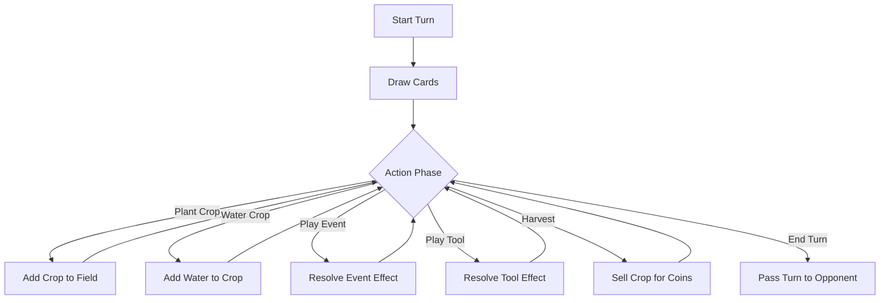

# Farmhand Shuffle: Game Rules & Design

Welcome to **Farmhand Shuffle**, a strategic card game where you compete to build the most profitable farm while sabotaging your rival! This document outlines the high-level game rules, card types, and flow of play.

## 🎯 Objective

The goal of Farmhand Shuffle is simple: **Bankrupt your opponent.**

Players take turns managing their farms, harvesting crops for money, and paying taxes/fees. If a player runs out of funds (Coins), the game ends immediately, and the surviving player is declared the winner.

---

## 🃏 Card Types

There are four distinct types of cards in the deck:

### 🌱 Crops
These are the foundation of your farm.
- **Action:** You plant these into your **Field** (maximum 6 slots).
- **Growth:** Each crop requires a specific amount of **Water** to mature.
- **Harvest:** Once fully watered, a crop can be harvested to earn Coins.

### 💧 Water
Essential for growing your crops.
- **Action:** You play a Water card directly onto a planted Crop in your field.
- **Effect:** Increases the crop's water level. When the water level meets the crop's requirement, it becomes ready for harvest.

### ⚡ Events
Powerful, one-time effects that can turn the tide of the game.
- **Limit:** You can only play **1 Event card per turn**.
- **Effect:** Varied effects, such as stealing funds, destroying opponent crops, or drawing extra cards.

### 🛠️ Tools
Utility cards that provide bonuses or special actions.
- **Limit:** You can play as many Tool cards as you want during your turn.
- **Effect:** Can be immediate bonuses or lasting effects that help you manage your farm more efficiently.

---

## 🔄 Game Flow

The game is controlled by a state machine that ensures fair play and structured turns.

### 1. Setup Phase
Before the first turn begins:
- Each player starts with **50 Coins**.
- Each player draws an initial hand of **7 cards**.
- Players have a chance to plant initial crops into their field.
- Once setup is complete, the first turn begins.

### 2. Turn Structure

On your turn, you are free to perform actions in any order until you decide to end your turn.

#### Key Actions
*   **Draw:** You automatically draw 1 card at the start of your turn.
*   **Plant:** Move a Crop card from your hand to an empty slot in your field.
*   **Water:** Select a Water card from your hand, then choose a Crop to water.
*   **Harvest:** If a crop has enough water, you can harvest it to add its value to your funds. The crop is then discarded.
*   **Pass:** When you are done, you pass play to the opponent.

---

## 🤖 The Automated Opponent (Bot)

You play against an automated bot that follows the same rules as you. However, the bot is efficient and follows a strict routine every turn:

1.  **Analyze:** It assesses the board state.
2.  **Plant:** It plays as many crops as it deems necessary.
3.  **Water:** It waters its crops intelligently.
4.  **Events:** It plays an Event card if beneficial.
5.  **Tools:** It utilizes Tools to maximize its advantage.
6.  **Harvest:** It harvests any ready crops to secure funds.

The bot acts quickly, so keep an eye on the notification log to see what moves it made!

---

## 🏆 Winning & Losing

The economy is unforgiving. Throughout the game, various effects or costs may deplete a player's funds.

*   **Game Over:** The moment a player's funds drop below zero (or they cannot pay a required cost), they lose.
*   **Victory:** If your opponent goes bankrupt, you win!
